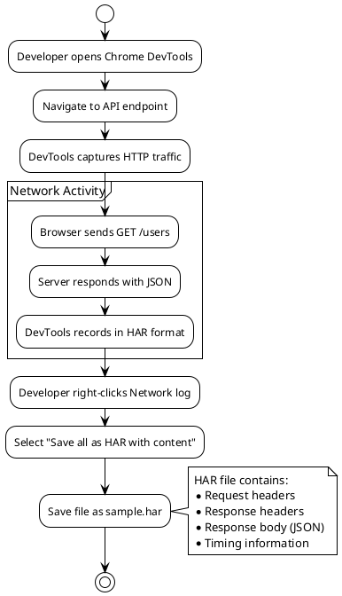
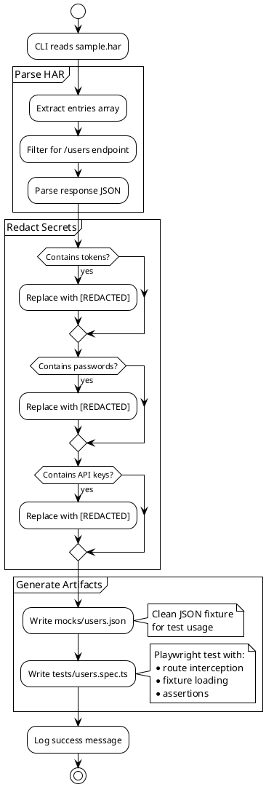
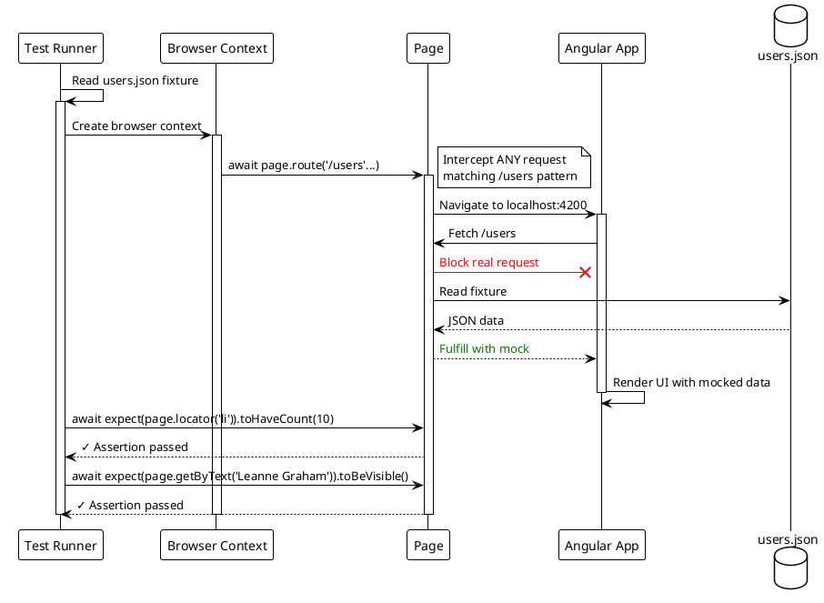
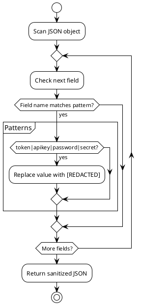
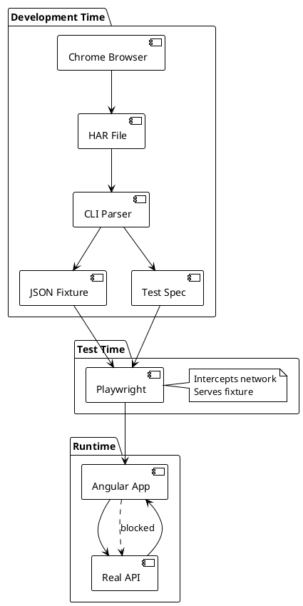

# Architecture

This document explains the technical flow of GhostMocks Demo with PlantUML diagrams.

## 🏗️ System Overview

```plantuml
@startuml
!theme plain

actor Developer
participant "Chrome\nDevTools" as Chrome
participant "CLI\n(HAR Parser)" as CLI
database "users.json\n(Fixture)" as Fixture
participant "Angular\nApp" as App
participant "Playwright\nTest" as Test
cloud "jsonplaceholder\n.typicode.com" as API

== Recording Phase ==
Developer -> Chrome: Browse API endpoint
Chrome -> API: GET /users
API --> Chrome: JSON response
Developer -> Chrome: Save as HAR
Chrome --> CLI: sample.har

== Generation Phase ==
Developer -> CLI: node cli/index.js sample.har
CLI -> CLI: Parse HAR\nRedact secrets
CLI --> Fixture: Write users.json
CLI --> Test: Generate users.spec.ts

== Development Phase ==
Developer -> App: npm run start:app
App -> API: GET /users
API --> App: Real JSON data
App --> Developer: Display user list

== Testing Phase ==
Developer -> Test: npm run test
Test -> Test: route.fulfill(users.json)
Test -> App: Launch & intercept
App -[#red]x API: <color red>Request blocked</color>
Test --> App: <color green>Serve fixture</color>
App --> Test: Render mocked data
Test -> Test: Assert UI elements
Test --> Developer: ✓ Test passed

@enduml
```

## 🔄 Detailed Flow

### 1. HAR Recording Flow



### 2. CLI Generation Flow



### 3. Angular App Flow

```plantuml
@startuml
!theme plain

participant "Browser" as Browser
participant "AppComponent" as Component
participant "HttpClient" as Http
cloud "API" as API

Browser -> Component: Load app
activate Component

Component -> Component: ngOnInit()
Component -> Http: GET /users
activate Http

Http -> API: HTTPS Request
activate API
API --> Http: JSON Response
deactivate API

Http --> Component: Observable<User[]>
deactivate Http

Component -> Component: users$ = response
Component -> Browser: Render user list

note over Browser
  <ul>
    <li>Leanne Graham</li>
    <li>Ervin Howell</li>
    ...
  </ul>
end note

deactivate Component

@enduml
```

### 4. Playwright Test Flow



## 🧩 Component Breakdown

### CLI Parser (cli/index.js)

**Purpose**: Transform HAR recordings into usable test fixtures.

**Key Functions**:

```javascript
parseHAR(harContent)
  ├─> Extract entries[]
  ├─> Find /users requests
  └─> Parse response JSON

redactSecrets(data)
  ├─> Regex match tokens/passwords/keys
  └─> Replace with [REDACTED]

generateFixture(data, outputPath)
  └─> Write JSON file

generateTest(endpoint, fixturePath, outputPath)
  └─> Write Playwright spec
```

**Input**: `sample.har` (Chrome HAR format)  
**Output**: 
- `angular-demo/mocks/users.json`
- `angular-demo/tests/users.spec.ts`

### Angular App

**Purpose**: Simple UI that demonstrates API consumption.

**Components**:

```typescript
AppComponent
  ├─> HttpClient.get<User[]>()
  ├─> users$ Observable
  └─> Template with *ngFor
```

**Why?**: Shows real API integration that can be tested with mocks.

### Playwright Test

**Purpose**: Automated testing with network interception.

**Key Concepts**:

```typescript
await page.route('**/users', async route => {
  // Intercept the request
  const fixture = JSON.parse(fs.readFileSync('mocks/users.json', 'utf-8'));
  // Fulfill with mock data instead of hitting real API
  await route.fulfill({ json: fixture });
});
```

**Benefits**:
- ⚡ Fast (no network calls)
- 🔒 Deterministic (same data every time)
- 📴 Offline (no internet needed)
- 🔐 Secure (no real credentials)

## 🔐 Security: Secret Redaction

The CLI automatically redacts common secret patterns:



**Protected Patterns**:
- `Authorization` headers
- Fields named: `token`, `apiKey`, `password`, `secret`, `credential`
- Bearer tokens in strings

## 📊 Data Flow Diagram



## 🎯 Design Decisions

### Why HAR Format?

- **Standard**: Chrome, Firefox, and most browsers support it
- **Complete**: Captures full request/response cycle
- **Easy**: Right-click to save, no special tools needed

### Why Generate Tests?

- **DRY**: Don't manually write boilerplate for each endpoint
- **Consistency**: All tests follow the same pattern
- **Speed**: Generate 100s of tests from one HAR file

### Why Playwright?

- **Modern**: Built-in network interception
- **Reliable**: Auto-waiting, no flaky tests
- **Cross-browser**: Test in Chromium, Firefox, WebKit

### Why Angular?

- **Popular**: Many teams use Angular
- **HttpClient**: Built-in, observable-based HTTP
- **Standalone**: No complex setup needed

## 🚀 Extending This Demo

### Add More Endpoints

```bash
# Generate fixtures for multiple endpoints
node cli/index.js my-app.har
```

The CLI will auto-detect all API calls and generate fixtures for each.

### Add Request Matching

Enhance Playwright tests to match request body:

```typescript
await page.route('**/users', async route => {
  const request = route.request();
  if (request.method() === 'POST') {
    // Serve different fixture for POST
  }
});
```

### Add Mock Server

Instead of Playwright interception, run a mock server:

```typescript
// Use MSW or json-server
json-server mocks/users.json --port 3000
```

## 📚 Further Reading

- [HAR Spec](http://www.softwareishard.com/blog/har-12-spec/)
- [Playwright Network](https://playwright.dev/docs/network)
- [Angular HttpClient](https://angular.io/guide/http)
- [Test Fixtures](https://martinfowler.com/bliki/TestFixture.html)

---

**Key Takeaway**: Automated test generation from real traffic = faster, more reliable tests!
